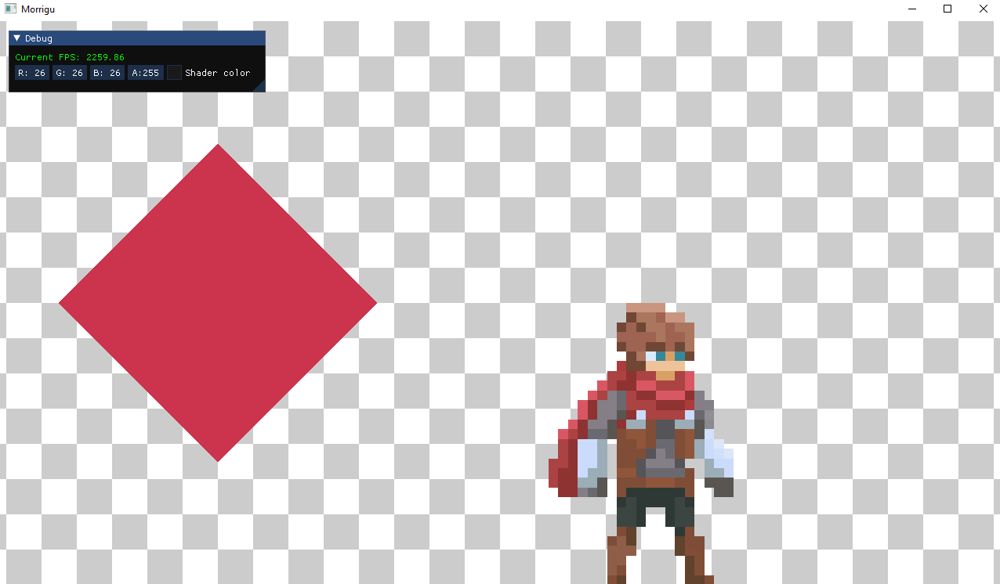

# Morrigu

<p align="center">

<br>


<br>
Morrigu is a barebone and cross-platform 2D game engine written in C++, and provides an abstracted renderer allowing you to write code once to render to either OpenGL or Vulkan. This is a hobby project, and if, for some reason, you consider using this for anything serious, I highly advice against it.
<br>
<br>
Here's a little showcase:
<br>

</p>

# Installation
## Requirements
To get up and running with Morrigu, you will need the following:
* A C++17 compiler (tested on MSVC, Clang and GCC);
* An installed and properly set up version of [Conan](https://conan.io/) (see [here](https://github.com/Ithyx/Morrigu/wiki/Setting-up-Conan) for initial set-up guide);
* A somewhat recent [CMake](https://cmake.org/) version (tested on 3.18.2, but versions a bit older should work);
* The [Vulkan SDK](https://vulkan.lunarg.com/sdk/home) (the newest version available).

## Compiling
Morrigu is compiled as a static library, and should be linked against by another application. To debug and provide examples, this repository includes a "Sandbox" project, and a `CMakeLists.txt` to go along. To compile everything (while making an out of source build), run the following commands:
### MSVC
```bash
mkdir build
cd build
conan install .. -s build_type=Debug --build=missing
conan install .. -s build_type=Release --build=missing
cmake ..
cmake --build . --config <CONFIG>
```
and replace `<CONFIG>` with the configuration you want, either `Debug` or `Release`.

### GCC/Clang (Unix makefiles)
```bash
mkdir build
cd build
conan install .. -s build_type=Debug --build=missing
conan install .. -s build_type=Release --build=missing
cmake .. -DCMAKE_BUILD_TYPE=<CONFIG>
cmake --build .
```
and replace `<CONFIG>` with the configuration you want, either `Debug` or `Release`.

### Vulkan shaders
To get the vulkan renderer working, you will have to to launch the `compile.sh` script located in `runtime/resources/shaders` to compile the Vulkan shaders.

If it helps you going, you can take a look at my [MSVC tasks](https://gist.github.com/Ithyx/6b81d75ad732ce785a198ecedc047fd8) for VS Code.

### Launching
To use the compiled executable, you have to set the working directory to the `runtime` folder of this repo.

Again, my VS Code launch configurations for MSVC are [here](https://gist.github.com/Ithyx/2cfc6da6c287797316535a4399beacdc) if it helps you.

# Usage
## Example code
The showcase you can see at the top of this `README` was obtained with [this code](https://gist.github.com/Ithyx/e0d4a085033d6665cbb9f0fa72589611).

## Changing rendering API
Changing the rendering API between OpenGL and Vulkan is currently done by changing the value of the `RenderingAPI::s_API` in the file `src/Morrigu/Renderer/RenderingAPI.cpp`.
A more user-friendly method is on the roadmap.

## Known bugs
A list of currently known bugs is maintained [here, on the wiki](https://github.com/Ithyx/Morrigu/wiki/Currently-known-bugs), if you want to take a look.

# Support
If you encounter a problem, feel free to create an issue. There is currently no template, so go wild (but not too wild, please). As this is a hobby project, I can't guarantee that I'll be able to respond quickly or even be able to fix your issue at all, but I'd be very glad to try and help you.

# Roadmap
Here are a few features and impovements that I would like to have in this engine at some point (not in order):
* Quaternion-based Rotation;
* Better rendering API switching (with conditional code compilation);
* Native and LUA scripting;
* Entity-component system;
* Graphical Editor;
* Maybe a 3D renderer (in the far future).

# Contributing
I am not not currently open to contribution, although that is subject to change. However, if you feel like this could help the project more stable or more portable, feel free to open a pull request anyways. No template nor guarantee once again.

# Acknowledgments
* This engine's architecture is based on [The Cherno's Hazel engine](https://github.com/TheCherno/Hazel);
* The Vulkan renderer was made thanks to [vulkan tutorial](https://vulkan-tutorial.com);
* The current (and temporary) repository logo, at the top of this `README`, is made by [Freepik](https://www.flaticon.com/authors/freepik) from [FlatIcon](https://www.flaticon.com/).

