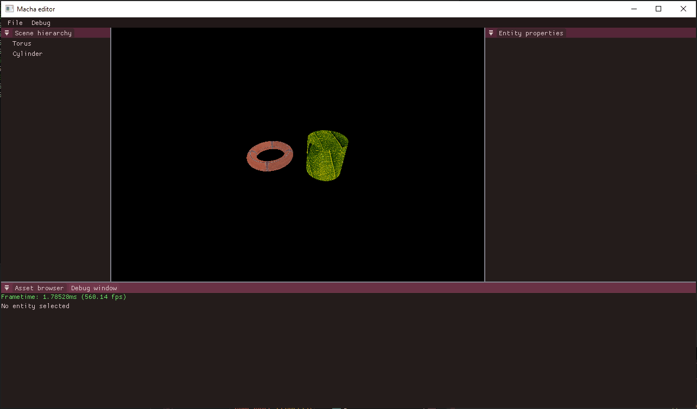
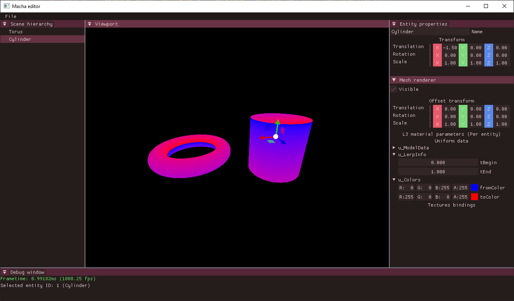
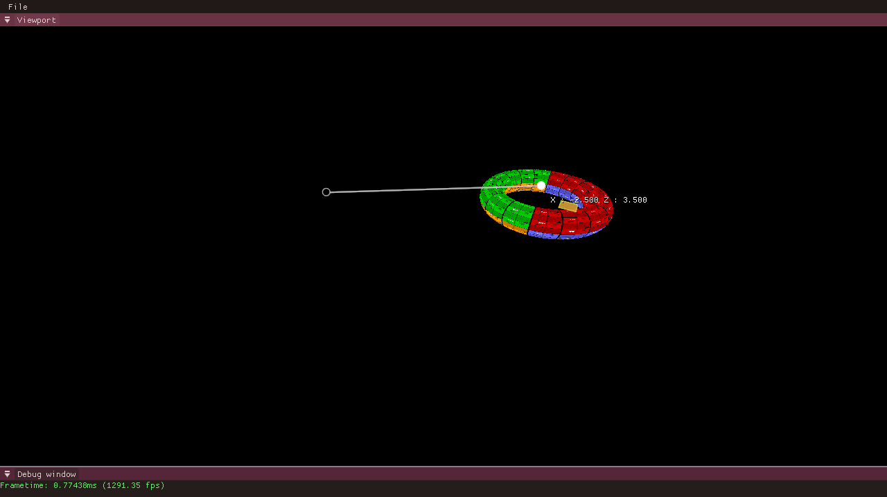

# Morrigu

Morrigu is a small 3D rendering engine developed from scratch by [me](https://github.com/Ithyx) to learn about 3D graphics.
It is made to be cross-platform (tested on Windows, Ubuntu, and Fedora) and uses C++20 for stuff like ranges and concepts. Tested with GCC-10 and MSVC 19.28.29915.

## Dependencies

This project relies on the following dependencies (non-exhaustive list, the complete dependency list can be found in the [conan file](../conanfile.txt))

* The windowing system is provided by GLFW
* The graphics API used is Vulkan, currently version 1.1.0 (SDK and drivers are required to compile)
* ImGui, more specifically the docking branch, is used for the UI, in conjunction with ImGuizmo.
* The build system is a combinaiton of CMake and Conan.

## How to build

As this project is still fairly young, things are still moving, so I won't have dedicated instructions until things have settled down. However, I try to maintain a [Dockerfile](../Dockerfile) up to date to compile the project on Ubuntu, so this is a good starting point to see what steps are needed to compile.

## Gallery

As time passes, I will add new screenshots of the engine in this section. New screenshots are added at the top of the list (bottom images are older).

* 2021/12/24: Adding some UI features, now textures can be bound to objects from an asset viewer (although no security is provided yet)

* 2021/12/04: Still working on the ECS, here is a limited prototype of a material editor in a properties panel

* 2021/11/23: Working on the ECS for the engine, here is the first prototype of a hierarchy panel

* 2021/11/07: Merging the `restart` branch, showcasing the use of ImGui and ImGuizmo for the UI

